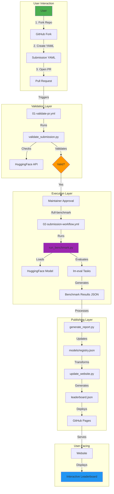
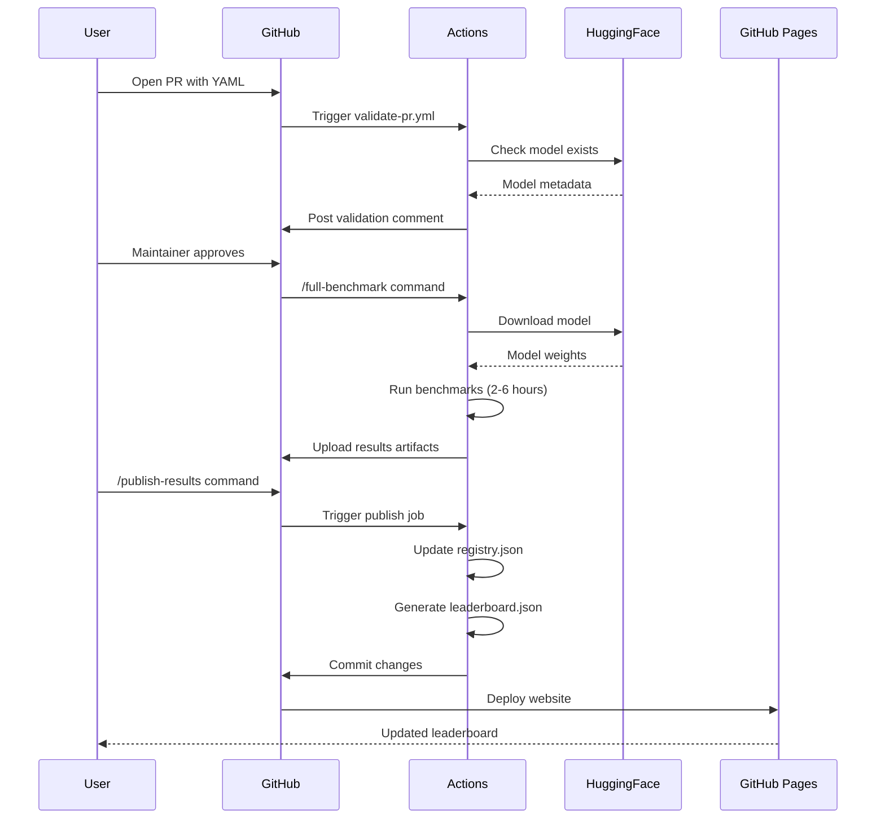
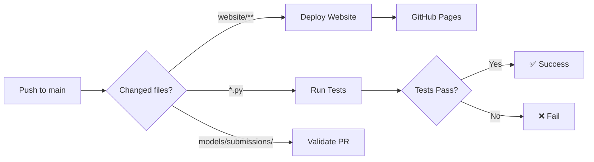

# SLM Benchmark Architecture

## System Overview

SLM Benchmark is a fully automated, GitHub-centric benchmarking platform for Small Language Models. The architecture is designed to be:

- **Zero-cost**: Runs entirely on GitHub Actions and GitHub Pages
- **Transparent**: All code, data, and results are public
- **Reproducible**: Deterministic evaluation with documented configurations
- **CPU-friendly**: No GPU required, runs on commodity hardware

## High-Level Architecture



## Component Breakdown

### 1. Submission Layer

#### `models/submissions/*.yaml`
- **Purpose**: Model submission files
- **Format**: YAML with minimal required fields
- **Auto-detection**: Most properties detected from HuggingFace

**Example**:
```yaml
model:
  hf_repo: "HuggingFaceTB/SmolLM2-135M"
```

#### `benchmarks/validation/auto_detector.py`
- **Purpose**: Auto-detect model properties from HuggingFace
- **Detects**: Name, parameters, architecture, context length, quantizations
- **API**: Uses `huggingface_hub` to fetch `config.json`

### 2. Validation Layer

#### `.github/workflows/01-validate-pr.yml`
- **Trigger**: PR opened/updated on `models/submissions/*.yaml`
- **Steps**:
  1. Rate limit check (max 3 submissions/user/week)
  2. YAML schema validation
  3. HuggingFace model existence check
  4. Parameter count verification (≤ 3B)
  5. Duplicate detection
  6. Cost estimation
- **Output**: Validation report posted as PR comment

#### `.github/scripts/validate_submission.py`
- **Validates**:
  - Required fields (name, hf_repo, parameters, etc.)
  - Parameter format (`1.7B`, `135M`)
  - License compatibility
  - HuggingFace repo accessibility
  - Quantization formats
- **Returns**: JSON report with errors/warnings

### 3. Execution Layer

#### `.github/workflows/02-submission-workflow.yml`
- **Triggers**:
  - `/quick-test`: Fast smoke test (100 samples, ~5 min)
  - `/full-benchmark`: Complete evaluation (~2-6 hours)
  - `/publish-results`: Merge and publish to leaderboard
- **Jobs**:
  1. `auto-validate`: Runs on PR open
  2. `quick-test`: Maintainer-triggered smoke test
  3. `full-benchmark`: Full evaluation suite
  4. `publish`: Update registry and deploy

#### `benchmarks/evaluation/run_benchmark.py`
- **Main orchestrator** for benchmark execution
- **Configuration**: `BenchmarkConfig` dataclass
- **Evaluation pillars**:
  - Reasoning: MMLU, ARC-Challenge, HellaSwag, TruthfulQA
  - Coding: HumanEval, MBPP
  - Math: GSM8K, MATH QA
  - Language: BoolQ, PIQA, WinoGrande
  - Safety: Toxicity, bias, truthfulness probes
  - Edge (optional): Latency, memory, energy
- **Output**: JSON files per quantization + summary

**Key Methods**:
- `load_model()`: Loads model via lm-eval HFLM backend
- `run_*_benchmarks()`: Runs category-specific evaluations
- `calculate_aggregate_score()`: Weighted average (hardware-agnostic)
- `save_results()`: Writes JSON to `results/raw/`

#### Evaluation Modules

| Module | Purpose | Hardware-Dependent |
|--------|---------|-------------------|
| `edge_benchmark.py` | Latency, throughput, memory | ✅ Yes |
| `carbon_tracker.py` | Energy consumption (CodeCarbon) | ✅ Yes |
| `safety_eval.py` | Toxicity, bias, truthfulness | ❌ No |
| `long_context_eval.py` | Long context tasks | ❌ No |
| `bias_fairness_eval.py` | Fairness probes | ❌ No |

### 4. Processing Layer

#### `scripts/generate_report.py`
- **Input**: `results/raw/**/*.json`
- **Output**: `results/processed/latest_benchmark.json`
- **Function**: Aggregates results across quantizations

#### `scripts/update_registry.py`
- **Input**: Submission YAML + processed results
- **Output**: Updated `models/registry.json`
- **Function**: Merges new model into registry, calculates rank

**Registry Schema**:
```json
{
  "models": [
    {
      "id": "model-id",
      "name": "Display Name",
      "family": "Model Family",
      "hf_repo": "org/model",
      "parameters": "1.7B",
      "aggregate_score": 45.2,
      "scores": {
        "reasoning": 48.3,
        "coding": 42.1,
        "math": 38.5,
        "language": 46.8,
        "safety": 52.3,
        "edge": 0.0
      },
      "efficiency_score": 1250.5,
      "co2_kg": 0.0023,
      "quantizations": [...],
      "rank": 1
    }
  ],
  "metadata": {
    "last_updated": "2026-01-14T...",
    "total_models": 42
  }
}
```

#### `scripts/update_website.py`
- **Input**: `models/registry.json`
- **Output**: `website/assets/data/leaderboard.json`
- **Function**: Copies registry to website data directory

### 5. Presentation Layer

#### `website/` - Static GitHub Pages Site

**Pages**:
- `index.html`: Leaderboard with filtering/sorting
- `model.html`: Model detail page with charts
- `methodology.html`: Scoring methodology
- `submit.html`: Submission guide
- `support.html`: Help and troubleshooting

**JavaScript Components**:

| File | Purpose |
|------|---------|
| `leaderboard.js` | Main leaderboard logic, filtering, sorting |
| `leaderboard-filters.js` | Advanced filter controls |
| `model-comparison.js` | Side-by-side model comparison |
| `carbon-viz.js` | CO₂ visualization charts |
| `main.js` | Theme toggle, global utilities |

**Key Features**:
- **Client-side rendering**: Fetches `leaderboard.json`, renders dynamically
- **Filtering**: Search, size, category filters
- **Sorting**: By rank, aggregate, individual pillars
- **Responsive**: Mobile-friendly design
- **Dark mode**: Theme toggle with localStorage persistence

## Data Flow

### Submission to Leaderboard



## Scoring Methodology

### Aggregate Score Calculation

```python
weights = {
    'reasoning': 0.35,
    'coding': 0.20,
    'math': 0.15,
    'language': 0.20,
    'safety': 0.20
}

aggregate_score = sum(scores[k] * weights[k] for k in weights.keys())
```

**Excluded from ranking**:
- Edge metrics (latency, memory, throughput)
- Energy consumption
- CO₂ emissions
- Efficiency score

**Rationale**: Hardware-dependent metrics vary across machines, making fair comparison impossible.

### Efficiency Score (Informational Only)

```python
efficiency_score = aggregate_score / energy_consumed_kwh
```

Reported for transparency but not used in ranking.

## Reproducibility

### Deterministic Evaluation

```python
# Set in run_benchmark.py
torch.manual_seed(42)
torch.cuda.manual_seed_all(42)
torch.backends.cudnn.deterministic = True
os.environ['PYTHONHASHSEED'] = '42'
```

### System Info Logging

Every benchmark run logs:
- Python version
- PyTorch version
- CUDA availability and version
- GPU name and memory
- Platform (OS)

### Result Artifacts

All results are saved as JSON with:
- Full task-level scores
- System configuration
- Timestamp
- Model metadata

## Security Considerations

### PR Validation

- **Path restrictions**: PRs can only modify `models/submissions/`
- **Malicious code**: No arbitrary code execution from submissions
- **Rate limiting**: Max 3 submissions per user per week
- **Maintainer approval**: Required before benchmark execution

### Workflow Permissions

```yaml
permissions:
  contents: write      # Update registry
  pull-requests: write # Comment on PRs
  pages: write         # Deploy website
  id-token: write      # GitHub Pages deployment
```

### Secrets

No secrets required! Everything runs on:
- Public HuggingFace models
- GitHub Actions free tier
- GitHub Pages (free for public repos)

## Deployment

### GitHub Pages

**Configuration**:
- Source: `main` branch, `/website` directory
- Custom domain: Optional
- HTTPS: Enforced

**Deployment Trigger**:
```yaml
# .github/workflows/deploy-website.yml
on:
  push:
    branches: [main]
    paths:
      - 'website/**'
      - 'models/registry.json'
```

### CI/CD Pipeline



## Extensibility

### Adding a New Benchmark

1. **Create evaluation module**: `benchmarks/evaluation/my_benchmark.py`
2. **Implement evaluation logic**:
   ```python
   class MyBenchmark:
       def evaluate(self, model) -> Dict:
           # Return {task_name: score}
           pass
   ```
3. **Update `run_benchmark.py`**:
   ```python
   self.results['my_scores'] = self.run_my_benchmarks(model)
   ```
4. **Update aggregate calculation** (if applicable)
5. **Update website** to display new scores

### Adding a New Filter

1. **Update `index.html`**: Add filter control
2. **Update `leaderboard.js`**: Add filter logic in `applyFilters()`
3. **Update registry schema** (if new metadata needed)

## Performance Considerations

### Benchmark Runtime

| Model Size | Quick Test | Full Benchmark |
|------------|------------|----------------|
| 100M-500M  | ~5 min     | ~1-2 hours     |
| 500M-1B    | ~10 min    | ~2-4 hours     |
| 1B-3B      | ~15 min    | ~4-6 hours     |

### Optimization Strategies

- **Caching**: HuggingFace models cached between runs
- **Batching**: Configurable batch size (default: 8)
- **Limiting**: `--limit N` for testing (samples per task)
- **Parallel**: Multiple quantizations can run in parallel (future)

## Monitoring & Observability

### Logging

```python
# Structured logging in run_benchmark.py
logger.info(f"Loading model: {hf_repo}")
logger.info(f"Running reasoning benchmarks...")
logger.error(f"Failed to load model: {error}")
```

### Metrics Tracked

- Benchmark success/failure rate
- Average runtime per model size
- Most common errors
- Submission volume

## Future Enhancements

- [ ] Distributed benchmark execution (Modal, RunPod)
- [ ] Real-time leaderboard updates (WebSocket)
- [ ] Model comparison tool (side-by-side)
- [ ] API for programmatic access
- [ ] Multilingual benchmarks
- [ ] Long-context evaluation (32k+ tokens)
- [ ] Function calling benchmarks

---

## Quick Reference

### Key Files

| Path | Purpose |
|------|---------|
| `models/registry.json` | Single source of truth for leaderboard |
| `website/assets/data/leaderboard.json` | Website data (copy of registry) |
| `benchmarks/evaluation/run_benchmark.py` | Main benchmark orchestrator |
| `.github/workflows/02-submission-workflow.yml` | Benchmark execution workflow |
| `scripts/update_registry.py` | Registry update logic |

### Key Commands

```bash
# Validate submission
python .github/scripts/validate_submission.py \
  --submission-file models/submissions/my-model.yaml \
  --output report.json

# Run benchmark
python benchmarks/evaluation/run_benchmark.py \
  --submission-file models/submissions/my-model.yaml \
  --output-dir results/test/ \
  --limit 5

# Update registry
python scripts/update_registry.py \
  --submission models/submissions/my-model.yaml \
  --results results/processed/report.json \
  --registry models/registry.json

# Update website
python scripts/update_website.py \
  --registry models/registry.json \
  --output website/assets/data/leaderboard.json
```

---

**Last Updated**: 2026-01-14  
**Version**: 1.0.0
